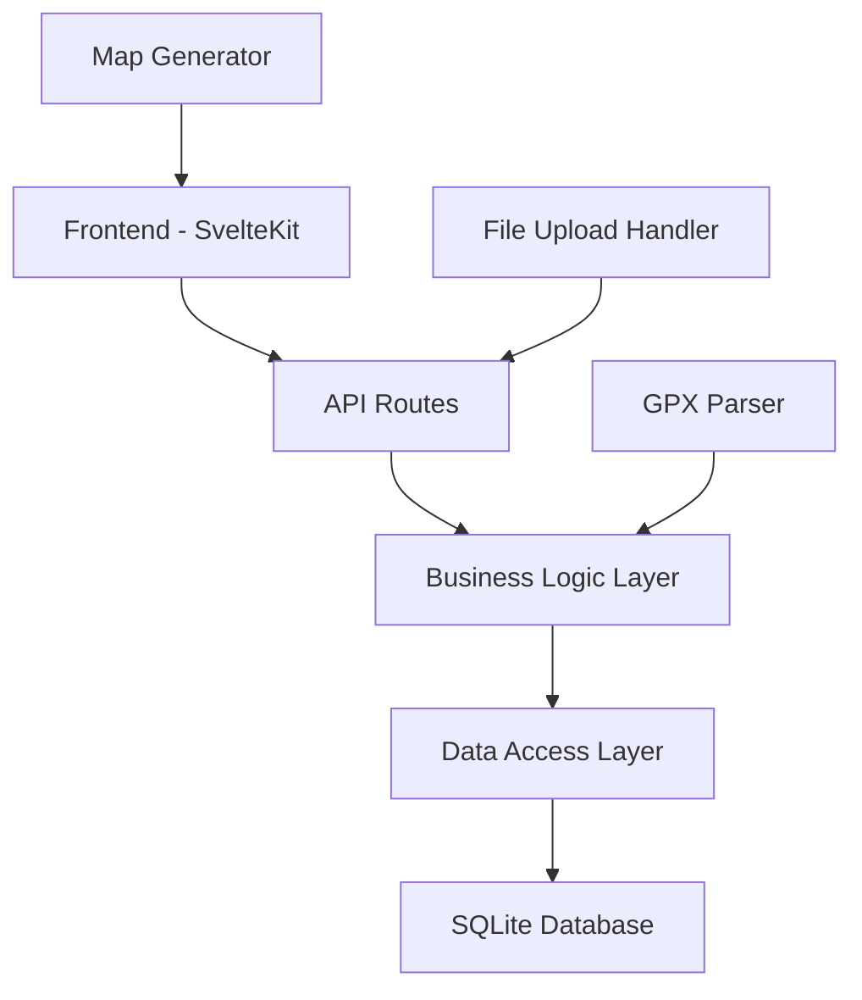

# Design Document - GPX Activity Tracker

## Overview

La aplicación GPX Activity Tracker será una aplicación web construida con SvelteKit que permite a los usuarios importar archivos GPX, visualizar actividades y generar mapas compartibles. La arquitectura seguirá el patrón MVC adaptado para SvelteKit con una base de datos SQLite para persistencia local.

## Architecture

### High-Level Architecture



### Technology Stack

- **Frontend**: SvelteKit con TypeScript
- **Backend**: SvelteKit API routes (server-side)
- **Database**: SQLite con better-sqlite3
- **GPX Processing**: gpx-parser-builder library
- **Maps**: Leaflet.js para renderizado de mapas
- **Styling**: TailwindCSS para UI consistente

## Components and Interfaces

### Frontend Components

#### 1. Layout Components
- `+layout.svelte`: Layout principal con navegación
- `Header.svelte`: Barra de navegación superior
- `Sidebar.svelte`: Navegación lateral (opcional)

#### 2. Page Components
- `+page.svelte` (Dashboard): Página principal con estadísticas
- `activities/+page.svelte`: Lista de actividades
- `activities/[id]/+page.svelte`: Detalles de actividad individual
- `upload/+page.svelte`: Página de carga de archivos GPX
- `map/[id]/+page.svelte`: Generador de mapas

#### 3. UI Components
- `ActivityCard.svelte`: Tarjeta individual de actividad
- `StatsWidget.svelte`: Widget de estadísticas para dashboard
- `FileUploader.svelte`: Componente de carga de archivos
- `MapViewer.svelte`: Visualizador de mapas interactivo
- `MapGenerator.svelte`: Generador de mapas para compartir

### Backend API Routes

#### 1. Activity Management
- `GET /api/activities`: Obtener todas las actividades
- `GET /api/activities/[id]`: Obtener actividad específica
- `POST /api/activities`: Crear nueva actividad desde GPX
- `DELETE /api/activities/[id]`: Eliminar actividad

#### 2. File Processing
- `POST /api/upload`: Procesar archivo GPX
- `GET /api/activities/[id]/gpx`: Obtener datos GPX originales

#### 3. Statistics
- `GET /api/stats`: Obtener estadísticas generales
- `GET /api/stats/monthly`: Obtener estadísticas mensuales

#### 4. Map Generation
- `GET /api/map/[id]`: Generar datos para mapa
- `POST /api/map/[id]/export`: Exportar mapa como imagen

## Data Models

### Database Schema

```sql
-- Activities table
CREATE TABLE activities (
    id INTEGER PRIMARY KEY AUTOINCREMENT,
    name TEXT NOT NULL,
    type TEXT NOT NULL DEFAULT 'unknown',
    start_time DATETIME NOT NULL,
    end_time DATETIME NOT NULL,
    distance REAL NOT NULL,
    duration INTEGER NOT NULL, -- in seconds
    elevation_gain REAL DEFAULT 0,
    average_speed REAL NOT NULL,
    max_speed REAL DEFAULT 0,
    created_at DATETIME DEFAULT CURRENT_TIMESTAMP,
    updated_at DATETIME DEFAULT CURRENT_TIMESTAMP
);

-- GPS Points table
CREATE TABLE gps_points (
    id INTEGER PRIMARY KEY AUTOINCREMENT,
    activity_id INTEGER NOT NULL,
    latitude REAL NOT NULL,
    longitude REAL NOT NULL,
    elevation REAL,
    timestamp DATETIME NOT NULL,
    sequence_order INTEGER NOT NULL,
    FOREIGN KEY (activity_id) REFERENCES activities(id) ON DELETE CASCADE
);

-- Create indexes for performance
CREATE INDEX idx_activities_start_time ON activities(start_time);
CREATE INDEX idx_gps_points_activity_id ON gps_points(activity_id);
CREATE INDEX idx_gps_points_sequence ON gps_points(activity_id, sequence_order);
```

### TypeScript Interfaces

```typescript
interface Activity {
  id: number;
  name: string;
  type: ActivityType;
  startTime: Date;
  endTime: Date;
  distance: number; // in meters
  duration: number; // in seconds
  elevationGain: number; // in meters
  averageSpeed: number; // in m/s
  maxSpeed: number; // in m/s
  createdAt: Date;
  updatedAt: Date;
}

interface GPSPoint {
  id: number;
  activityId: number;
  latitude: number;
  longitude: number;
  elevation?: number;
  timestamp: Date;
  sequenceOrder: number;
}

interface ActivityStats {
  totalActivities: number;
  totalDistance: number;
  totalDuration: number;
  longestActivity: Activity;
  currentMonthStats: MonthlyStats;
  previousMonthStats: MonthlyStats;
}

interface MonthlyStats {
  activities: number;
  distance: number;
  duration: number;
}

type ActivityType = 'running' | 'cycling' | 'walking' | 'hiking' | 'unknown';
```

## Error Handling

### Client-Side Error Handling
- Form validation para archivos GPX
- Manejo de errores de red con reintentos automáticos
- Mensajes de error user-friendly
- Loading states durante procesamiento de archivos

### Server-Side Error Handling
- Validación de archivos GPX con mensajes específicos
- Manejo de errores de base de datos
- Logging de errores para debugging
- Respuestas HTTP apropiadas con códigos de estado

### Error Types
```typescript
interface AppError {
  code: string;
  message: string;
  details?: any;
}

// Error codes
const ERROR_CODES = {
  INVALID_GPX: 'INVALID_GPX_FILE',
  FILE_TOO_LARGE: 'FILE_TOO_LARGE',
  DATABASE_ERROR: 'DATABASE_ERROR',
  ACTIVITY_NOT_FOUND: 'ACTIVITY_NOT_FOUND',
  PROCESSING_ERROR: 'PROCESSING_ERROR'
} as const;
```

## Testing Strategy

### Unit Testing
- Utilidades de procesamiento GPX
- Funciones de cálculo de estadísticas
- Validadores de datos
- Componentes Svelte individuales

### Integration Testing
- API routes con base de datos de prueba
- Flujo completo de importación GPX
- Generación de mapas end-to-end

### Testing Tools
- Vitest para unit tests
- Playwright para E2E testing
- Testing Library para componentes Svelte

### Test Database
- SQLite en memoria para tests
- Fixtures con datos de prueba
- Cleanup automático entre tests

## Performance Considerations

### Database Optimization
- Índices en columnas frecuentemente consultadas
- Paginación para listas grandes de actividades
- Lazy loading de puntos GPS para mapas

### Frontend Optimization
- Code splitting por rutas
- Lazy loading de componentes pesados (mapas)
- Caching de estadísticas calculadas
- Optimización de imágenes de mapas

### File Processing
- Streaming para archivos GPX grandes
- Procesamiento asíncrono con progress indicators
- Validación temprana de archivos antes de procesamiento completo

## Security Considerations

### File Upload Security
- Validación estricta de tipos de archivo
- Límites de tamaño de archivo
- Sanitización de nombres de archivo
- Validación de contenido GPX

### Data Protection
- Validación de entrada en todas las API routes
- Sanitización de datos antes de almacenamiento
- Protección contra SQL injection (usando prepared statements)

## Deployment Architecture

### Development
- SvelteKit dev server
- SQLite file local
- Hot reloading habilitado

### Production
- SvelteKit adapter-node
- SQLite file persistente
- Nginx como reverse proxy (opcional)
- PM2 para process management